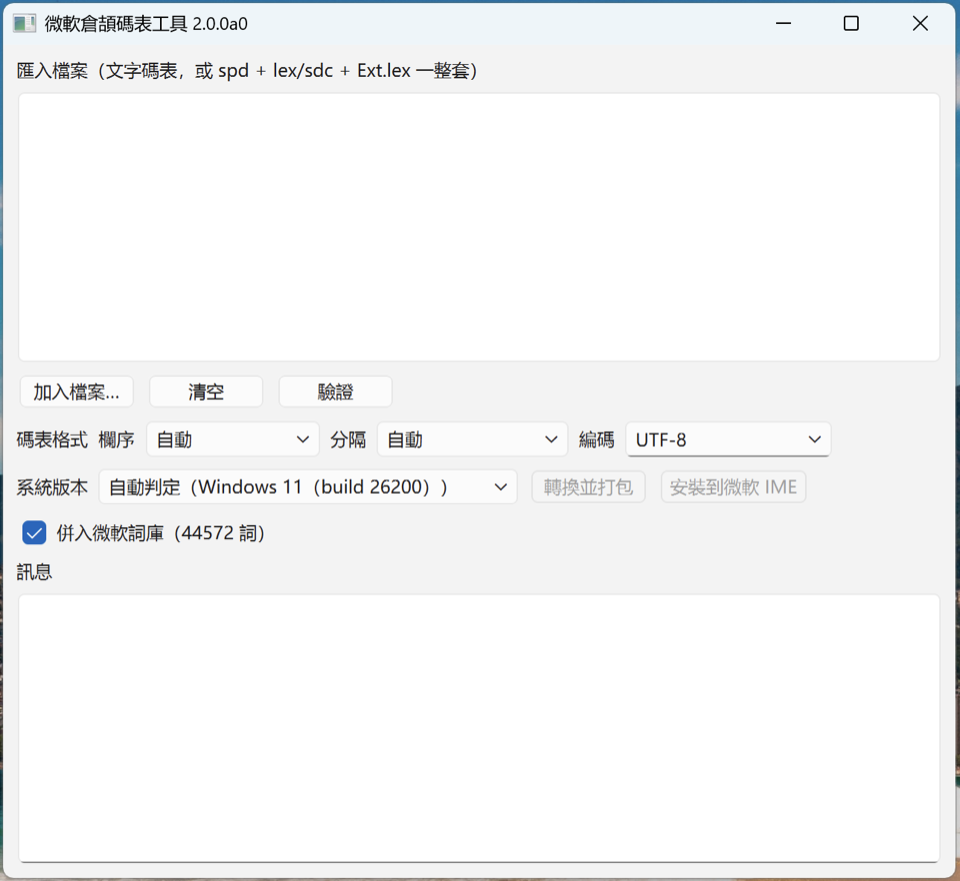

# MicrosoftCangjieTool

用您自己的倉頡碼表替換 Windows 內建的「微軟倉頡」碼表。

微軟倉頡的原廠碼表檔有許多訛誤：不少字用正確的倉頡碼打不出來，重碼字序也很不合理（例如「佑」排在「知」之前）。偏偏系統沒有提供更換碼表的選項，您是否為此十分苦惱？用本工具，只要準備一份您喜歡的純文字碼表，就能轉成微軟倉頡的二進位辭典檔，直接裝進系統。

## 項目歷史與版本說明

> **v2 版本：最新版本，用 Python 徹底重寫，解決了 v1 的問題，功能更豐富、使用更方便。**
>
> v1 版本寫於 2020 年年初，用 C++/Qt 實現，只能生成 Ext 碼表，尚有部分字序問題未解決，也不支援安裝碼表；加上 Qt 維護不便，已經棄用。v1 保留在 [`legacy-cpp`](../../tree/legacy-cpp) 分支，以及 `0.2.1a` 等 tag / Release。

## 功能

- **轉換**：準備一份純文字碼表，就能轉成微軟倉頡辭典檔。
- **合併聯想詞**：倉頡輸入法在設計時沒有詞組特性，微軟倉頡同樣限制只能打單字。不過，微軟倉頡支持聯想詞功能，工具能把原廠的聯想詞詞庫（44572 條，已從官方檔解出並內附）合併進辭典，換碼表不會失去打聯想詞的能力。
- **安裝碼表**：在 Windows 上備份原檔、結束輸入法行程、把新辭典複製進系統目錄；萬一失敗也能從備份還原。手上已有現成的微軟倉頡二進位辭典，也能直接用它安裝。
- **驗證**：轉換或安裝前先檢查檔案有沒有問題，避免裝完輸入法崩掉。
- **跨版本轉換**：新版（`sdc`）↔ 舊版（`lex`）辭典互轉。

## 相容性

| 系統 | 狀態 |
|---|---|
| Windows 11 | 已在 25H2（build 26200.9168）實機驗證 |
| Windows 10 | 可用 |
| Windows 8.1 | 理論上可用，未經測試 |

辭典格式的細節見 [`docs/format-notes.md`](docs/format-notes.md)。

## 安裝與執行

### 下載打包版

到 [Releases](../../releases) 下載：

- **Windows**：`MSCJTool.exe`，單一檔免安裝。雙擊可打開圖形介面。若希望使用命令列，可執行 
  `MSCJTool.exe --help` / `MSCJTool.exe build …` 。初次啓動會解壓檔案到
  暫存資料夾，可能稍慢。
- **macOS**：`MSCJTool-macos.zip`，解壓可得 `MSCJTool.app`（Apple Silicon）。
  由於沒有做簽章，第一次開要在「系統設定 → 隱私權與安全性」按「仍要打開」，
  或在終端執行 `xattr -dr com.apple.quarantine MSCJTool.app`。因為 macOS 沒有微軟倉頡，
  只支持轉換 / 打包 / 驗證功能，辭典檔要拿到 Windows 再安裝。

### 從原始碼執行（任何平台）

```bash
git clone https://github.com/Arthurmcarthur/MicrosoftCangjieTool.git
cd MicrosoftCangjieTool
pip install -e ".[gui]"        # 只要命令列：pip install -e .
```

之後：

```bash
cjtoolkit-gui                  # 圖形介面
cjtoolkit --help              # 命令列
```

需要 Python 3.10+；圖形介面另需 PySide6（`[gui]` 會一起裝）。
非 Windows 平台可以轉換 / 打包 / 驗證，「安裝」功能停用。

## 圖形介面

<p align="center"></p>

1. **加入檔案**：一份純文字碼表，或一整套辭典二進位（`spd` + `lex`/`sdc` + 可選 `Ext.lex`）。
2. 選**碼表格式**（欄序 / 分隔 / 編碼）。
3. **驗證**：合法的碼表才會解鎖「轉換」「安裝」。
4. 選**系統版本**（決定產出哪一代辭典），按**轉換並打包**，選輸出資料夾。
5. **安裝到微軟 IME**（僅 Windows）：會彈出 UAC 要 求提升權限。在安裝前，請先把輸入法切成「英文（美國）」鍵盤或其他非微軟輸入法。

## 命令列

大多數情況只需要兩步：

```bash
# 純文字碼表 → 辭典套件（產出在 out/pack/）
cjtoolkit build cangjie.txt -o out

# 裝進系統（僅 Windows；非管理員會自動跳 UAC；--profile 預設 auto 依系統版本判定）
cjtoolkit install out/pack
cjtoolkit install out/pack --dry-run       # 先看它會做什麼，不動任何檔
```

從備份還原：

```bash
cjtoolkit uninstall "C:\Windows\System32\zh-hk\Backup_20260908-120000" --profile 2004
```

<details>
<summary>其他子命令</summary>

```bash
cjtoolkit validate cangjie.txt                              # 只驗純文字碼表
cjtoolkit validate ChtChangjie.spd ChtChangjie.lex ChtChangjieExt.lex --as-set
cjtoolkit convert cangjie.txt -o out                        # 只轉成三個文本檔（不打包）
cjtoolkit pack out --profile both                           # 三個文本檔 → 二進位
cjtoolkit transcode ChtChangjie.spd ChtChangjie.lex ChtChangjieExt.lex --to 2004 -o out
```
</details>

## 純文字碼表格式

碼表是一個純文字檔，一行一個字：一個漢字加它的倉頡碼，中間用 Tab 或空格隔開，`#` 開頭的行是註解。例如：

```text
日	a
月	b
明	ab
```

一個字有多個倉頡碼時，分成多行寫、每行一個碼，全部都打得出來。

工具需要知道三件事，預設都會**自動偵測**，只在偵測錯了才需要手動指定（GUI 有對應的三個下拉選單，命令列用參數）：

| 要素 | 參數 | 可選值 | 說明 |
|---|---|---|---|
| 欄序 | `--layout` | `auto` / `char-code` / `code-char` | 漢字在左是 `char-code`（`日<TAB>a`），倉頡碼在左是 `code-char`（`a<TAB>日`）|
| 分隔 | `--sep` | `auto` / `tab` / `space` | 欄之間用什麼隔開；`space` 接受一個或多個空白（空格或 Tab）|
| 編碼 | `--encoding` | `utf-8`（預設，容忍 BOM）/ `big5` / `big5hkscs` / `gb18030` / 任何 Python 編碼名 | 檔案的文字編碼 |

## 轉換規則

- 單字全用您的碼表；一字多碼時每個碼各出一條，全部可打。
- 基本平面（含擴展 A 區、相容字）進主辭典；非基本平面（擴展 B 區及以上）進 `Ext.lex`。
- 重碼順序 = 碼表行序。
- 聯想詞：預設併入內附的微軟聯想詞詞庫；`--phrases` 換自己的詞表，`--no-phrases` 全不要。

可調參數與更多細節見 [`docs/format-notes.md`](docs/format-notes.md)。

## 安裝流程與風險

`cjtoolkit install` 做的事：

1. 不是以管理員身分執行時，跳出 UAC 窗口要求提權。
2. 提醒您把輸入法切換到「英文（美國）」鍵盤或其他非微軟輸入法。
3. 結束 `ChtIME` / `MicrosoftIME` 行程（系統會立即自動重啟，屬正常）。
4. 把原檔備份到目標目錄的 `Backup_<時間戳>\`。
5. 刪除原檔、複製新檔。
   - 新版 `C:\Windows\System32\zh-hk\`：提權即可。
   - 舊版 `C:\Windows\InputMethod\CHT\`：原檔屬 TrustedInstaller，覆寫被拒時自動 `takeown` / `icacls` 取得所有權再試。
6. 重啟 `ctfmon`；可能要重新選一次輸入法或登出。

**這會覆寫系統檔。** 工具每次都會先備份原文件，通過`uninstall` 可以還原，不过日後的系統更新仍可能打破相容性，故使用風險微存。安裝前務必把輸入法整個切成「英文（美國）」鍵盤或其他**非微軟**輸入法 —— 只把倉頡切成英文模式不會解除檔案佔用，程式就無法替換。

**Windows 版本**：Windows 10 2004（build 19041）以後與 Windows 11 同時兼容新舊辭典文件，不过系統默認調用新版辭典文件，而這之前的版本則只能使用舊辭典文件 。`--profile auto`（預設）會自動判斷系統版本，Windows 10 2004 以後的系統會**同時**更新新舊兩處。

## 微軟倉頡碼表檔的位置

微軟倉頡的辭典是三個檔一組，隨系統版本放在不同目錄。想手動備份的話，備份這幾個檔：

| | 新版（Windows 10 2004 以後 / Windows 11） | 舊版（Windows 10 2004 以前；Windows 11 仍保留） |
|---|---|---|
| 目錄 | `C:\Windows\System32\zh-hk\` | `C:\Windows\InputMethod\CHT\` |
| 辭典本體 | `ChtCangjie.sdc` | `ChtChangjie.lex` |
| 合法碼表 | `ChtCangjie.spd` | `ChtChangjie.spd` |
| 擴充區字 | `ChtCangjieExt.lex` | `ChtChangjieExt.lex` |

Windows 10 2004及之後的版本、Windows 11預設使用「新版」碼表。但如果開啓「使用以前版本的微軟倉頡輸入法」開關，系統會調用舊版輸入法程式和文件。

舊版目錄裡的檔案屬 TrustedInstaller，手動替換要先 `takeown` / `icacls` 取得所有權（`cjtoolkit install` 會自動處理）。

## 開發

```bash
pip install -e ".[dev]"
pytest
```

打包（Nuitka 不跨平台，要在對應系統上跑）：

```bash
pip install -e ".[build]"
python scripts/build_windows.py       # Windows → build/MSCJTool.exe
python scripts/build_macos.py         # macOS   → build/MSCJTool.app (+ .zip)
```

`cjtoolkit/codec.py` 負責純文字碼表與二進位辭典檔之間的編解碼，已逐位元對齊三個官方 `.spd` 樣本；有些格式約束一旦違反會讓輸入法卡死，都列在 [`docs/format-notes.md`](docs/format-notes.md)。遠端獲取（`fetch`）模組還在，暫時未接入 CLI / GUI。

## 致謝

- [xionghuaidong](https://gitee.com/xionghuaidong)：是[微軟五筆碼表編輯器](https://gitee.com/gitwub/WubiTools)的作者，開更換微軟碼表之先河，本項目的 v1 舊版受他很大啓發。
- [mrhso](https://github.com/mrhso)：最早以 JavaScript 完成對 `ChtChangjieExt.lex` 的讀取，在他的基礎上，我才完全弄清該檔的碼表結構。

## 授權

MIT，見 [`LICENSE`](LICENSE)。
